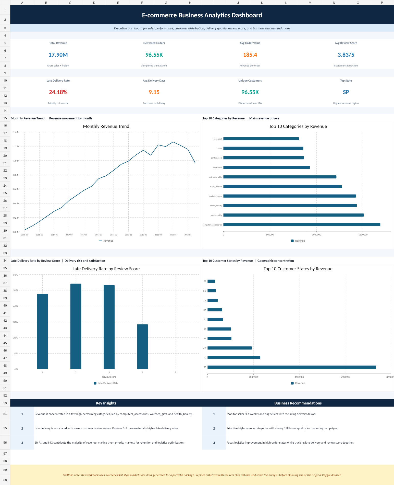

# E-commerce Business Analytics Dashboard

## Project Overview

This project is an end-to-end data analytics portfolio project that analyzes marketplace performance across sales, customer location, product categories, delivery performance, payment methods, seller performance, and customer review scores.

The main objective of this project is to identify business opportunities, operational issues, and actionable recommendations that can help improve revenue and customer satisfaction.

This project simulates a real Data Analyst workflow, starting from data preparation, data cleaning, feature engineering, SQL-based KPI analysis, dashboard development, and business insight generation.

## Business Objective

The analysis focuses on answering the following business questions:

1. How is monthly revenue trending over time?
2. Which product categories generate the highest revenue?
3. Which customer locations contribute the most revenue?
4. How does delivery performance affect customer review scores?
5. Which payment methods are most commonly used?
6. Which sellers should be monitored based on revenue, review score, and delivery performance?
7. What business recommendations can be made to improve revenue and customer satisfaction?

## Tools Used

- Python
- Pandas
- NumPy
- Matplotlib
- SQL
- Microsoft Excel
- GitHub

## Dataset

This project uses Olist-style e-commerce transactional data with a relational structure similar to a marketplace database.

The dataset includes several business entities:

- Orders
- Customers
- Products
- Sellers
- Order items
- Payments
- Reviews
- Product category translation

For portfolio reproducibility, the current version uses synthetic e-commerce data with the same table structure as the public Olist Brazilian E-commerce dataset. The workflow can be applied to the original Olist dataset by replacing the CSV files inside the `data/raw/` folder.

Dataset reference:

- Olist Brazilian E-commerce Public Dataset: https://www.kaggle.com/datasets/olistbr/brazilian-ecommerce

## Project Workflow

The project follows this analytics process:

1. Import raw CSV files
2. Understand table relationships
3. Clean and transform the data
4. Create new analytical features
5. Join multiple tables into one analysis-ready dataset
6. Calculate business KPIs using Python and SQL
7. Build summary tables
8. Create an Excel dashboard
9. Generate business insights
10. Provide business recommendations

## Key Metrics

| Metric | Value |
|---|---:|
| Total Revenue | 17.90M |
| Delivered Orders | 96.55K |
| Unique Customers | 96.55K |
| Average Order Value | 185.40 |
| Average Review Score | 3.83 |
| Late Delivery Rate | 24.18% |
| Average Delivery Days | 9.15 |

## Dashboard Preview



## Key Insights

### 1. Revenue is concentrated in several major product categories

The analysis shows that a few product categories contribute significantly to total revenue. The highest revenue category is `computers_accessories`.

This indicates that high-performing categories should be prioritized for campaign planning, stock management, and seller performance monitoring.

### 2. SP is the highest revenue-generating customer state

Customer revenue is highly concentrated in major states, especially SP. This suggests that regional marketing and logistics optimization should focus on high-demand areas first.

### 3. Late delivery is associated with lower customer review scores

Orders with lower review scores tend to have higher late delivery rates. This shows that delivery performance plays an important role in customer satisfaction.

### 4. Seller performance should be monitored beyond revenue

A seller may generate high revenue but still have delivery or review issues. Therefore, seller performance should be evaluated using multiple metrics such as revenue, order volume, review score, and late delivery rate.

## Business Recommendations

Based on the analysis, the recommended business actions are:

1. Prioritize high-revenue product categories for marketing campaigns and inventory planning.
2. Monitor late delivery rate regularly to improve customer satisfaction.
3. Focus regional marketing and logistics improvement on top revenue states.
4. Create a seller performance scorecard using revenue, review score, order volume, and delivery performance.
5. Use the dashboard as a weekly business review tool for sales, delivery, and customer satisfaction monitoring.

## Repository Structure

```text
ecommerce-business-analytics/
│
├── data/
│   ├── raw/
│   └── cleaned/
│
├── notebooks/
│   └── 01_ecommerce_data_cleaning_eda.ipynb
│
├── scripts/
│   └── run_analysis.py
│
├── sql/
│   └── ecommerce_analysis.sql
│
├── dashboard/
│   └── ecommerce_dashboard.xlsx
│
├── images/
│   └── dashboard_professional_preview.png
│
├── reports/
│   └── executive_summary.pdf
│
├── requirements.txt
└── README.md
