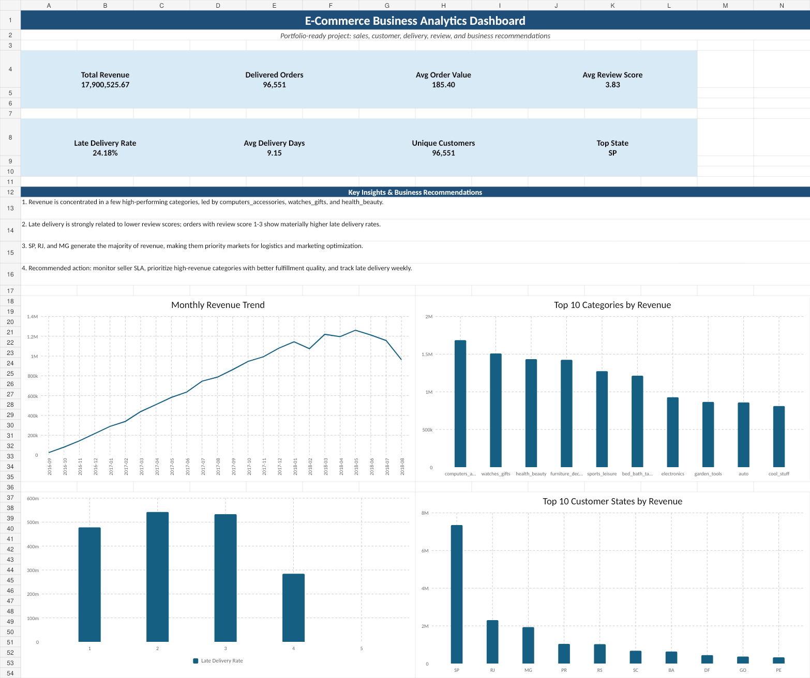
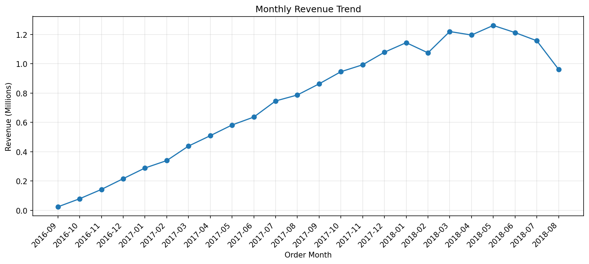
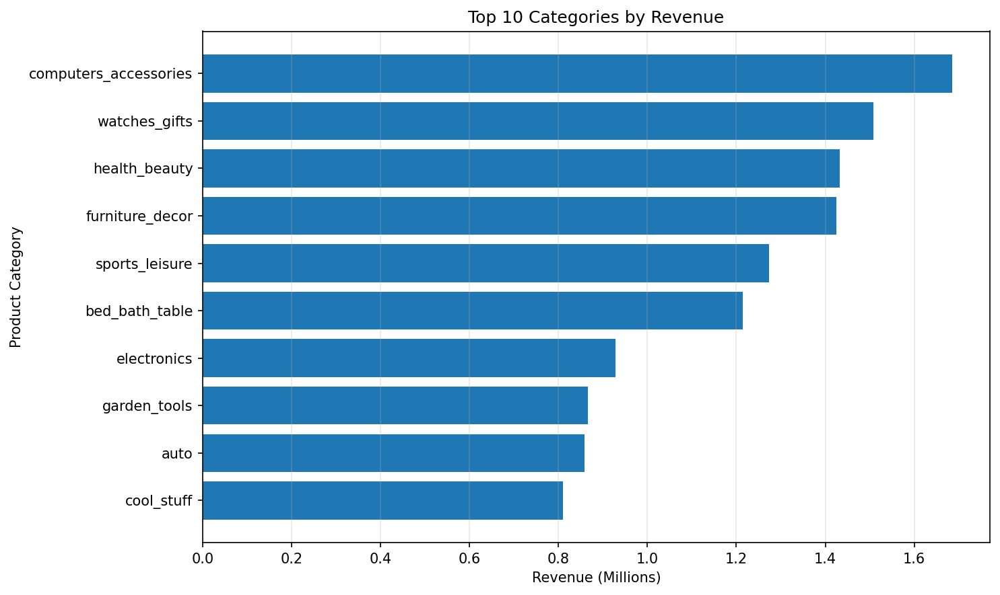
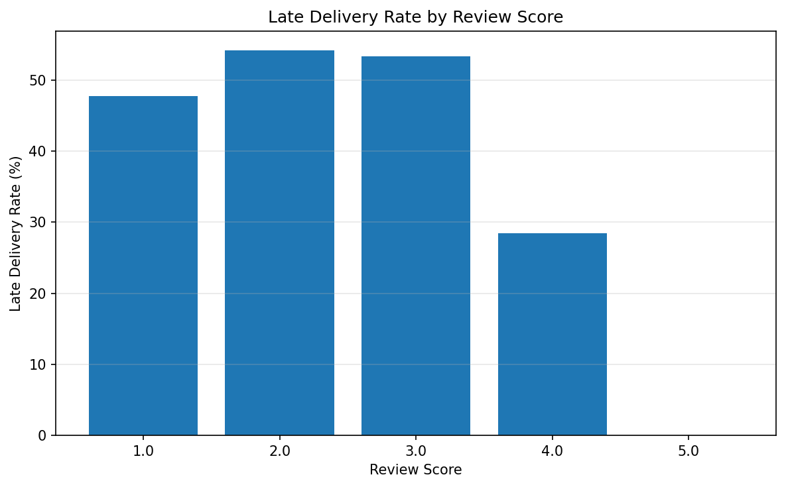

# E-commerce Business Analytics Dashboard

An end-to-end analytics project on marketplace data, covering sales performance, customer distribution, delivery quality, payment behavior, seller performance, and customer review scores. Built to practice the full workflow of a Data/Reporting Analyst: cleaning raw transactional data, calculating business KPIs, and turning the numbers into a dashboard and actionable recommendations.

## Data Note

The raw CSV files in `data/raw/` are synthetic data generated with the same table structure as the public Olist Brazilian E-Commerce dataset (orders, customers, products, sellers, payments, reviews). I used synthetic data instead of the original Kaggle files so the project could stay lightweight and shareable in this repo. The full pipeline (Python cleaning, SQL queries, Excel dashboard) is written to work with the real dataset too. See "Using the Original Olist Data" below if you want to reproduce it with real numbers.

Reference dataset: [Brazilian E-Commerce Public Dataset by Olist](https://www.kaggle.com/datasets/olistbr/brazilian-ecommerce) (Kaggle).

## Business Questions

1. What's the monthly revenue trend?
2. Which product categories bring in the most revenue?
3. Which customer states generate the highest revenue?
4. How does late delivery relate to review score?
5. Which payment methods are most used?
6. Which sellers need closer monitoring based on revenue, review score, and delivery performance?
7. What actions can improve revenue and customer satisfaction?

## Tools

- **Python (Pandas, NumPy)**: cleaning and joining 7 relational tables (orders, customers, products, sellers, payments, order items, reviews), plus feature engineering (delivery days, late delivery flag, revenue, AOV)
- **Matplotlib**: supporting charts (monthly revenue trend, top categories, delivery vs. review score, top states, payment mix)
- **SQL**: KPI queries (total revenue, delivered orders, top categories, late delivery rate)
- **Excel**: the dashboard itself, fully formula-driven

### About the Excel dashboard

Every number in `dashboard/ecommerce_dashboard.xlsx` is a live formula, not a pasted value. The `Data_*` sheets hold the cleaned data exported from the Python pipeline; every other sheet calculates from there using `SUM`, `SUMPRODUCT`, `INDEX`/`MATCH`, `LARGE`, and `RANK`. There are two interactive lookup panels (`Category_Lookup`, `Seller_Lookup`) where you pick an item from a dropdown and its metrics update automatically. I used `INDEX`/`MATCH` instead of `XLOOKUP` since it works across older Excel versions too, not just Excel 365.

## Repository Structure

```text
ecommerce_business_analytics_portfolio/
│
├── data/
│   ├── raw/                         # Olist-style raw CSV files
│   └── cleaned/                     # Cleaned analytical datasets and summary tables
│
├── notebooks/
│   └── 01_ecommerce_data_cleaning_eda.ipynb
│
├── sql/
│   └── ecommerce_analysis.sql
│
├── dashboard/
│   └── ecommerce_dashboard.xlsx
│
├── images/
│   ├── dashboard_screenshot.png
│   ├── monthly_revenue_trend.png
│   ├── top_categories_by_revenue.png
│   ├── late_delivery_by_review_score.png
│   ├── top_states_by_revenue.png
│   └── orders_by_payment_type.png
│
├── reports/
│   ├── executive_summary.md
│   └── executive_summary.pdf
│
├── scripts/
│   └── run_analysis.py
│
└── README.md
```

## Key Metrics

| Metric | Value |
|---|---:|
| Total Revenue | 17,900,525.67 |
| Delivered Orders | 96,551 |
| Unique Customers | 96,551 |
| Average Order Value | 185.40 |
| Average Review Score | 3.83 |
| Late Delivery Rate | 24.18% |
| Average Delivery Days | 9.15 |

## Findings

Revenue is concentrated in a handful of categories. `computers_accessories` alone brings in 1,685,925.43, the highest of any category, followed by `watches_gifts` and `health_beauty`. That's worth keeping in mind for stock planning and campaign prioritization.

Late delivery tracks closely with lower review scores. Orders with review scores of 1-3 show a noticeably higher late delivery rate than orders scored 4-5, so delivery performance looks like one of the clearest levers on customer satisfaction here.

SP, RJ, and MG drive most of the revenue, with SP alone accounting for 7,350,781.42, more than three times the next closest state. Logistics and marketing spend both make sense to prioritize around these states first.

Revenue and delivery quality don't always move together at the seller level either. A few sellers rank high on revenue but still carry elevated late delivery rates or lower review scores, the kind of gap a seller scorecard is meant to catch.

## Recommendations

1. Prioritize high-revenue categories for campaigns, stock planning, and seller quality checks.
2. Track seller SLA and high-delay routes weekly to bring down the late delivery rate.
3. Focus marketing spend on the top revenue states while testing smaller campaigns in lower-penetration ones.
4. Build a seller performance tiering system using revenue, late delivery rate, review score, and order volume together.
5. Use the dashboard as a recurring (weekly/monthly) review tool for revenue, orders, review score, and delivery KPIs.

## Dashboard Preview



## Charts

### Monthly Revenue Trend


### Top Categories by Revenue


### Late Delivery by Review Score


## Reproducing This

1. Clone or download this repo.
2. Install dependencies:

```bash
pip install pandas numpy matplotlib
```

3. Run the notebook:

```bash
jupyter notebook notebooks/01_ecommerce_data_cleaning_eda.ipynb
```

or the script directly:

```bash
python scripts/run_analysis.py
```

4. Open `dashboard/ecommerce_dashboard.xlsx` to explore the live dashboard.

## Using the Original Olist Data

1. Download the [Brazilian E-Commerce Public Dataset by Olist](https://www.kaggle.com/datasets/olistbr/brazilian-ecommerce) from Kaggle.
2. Replace the files in `data/raw/` with the original ones:
   - `olist_customers_dataset.csv`
   - `olist_order_items_dataset.csv`
   - `olist_order_payments_dataset.csv`
   - `olist_order_reviews_dataset.csv`
   - `olist_orders_dataset.csv`
   - `olist_products_dataset.csv`
   - `olist_sellers_dataset.csv`
   - `product_category_name_translation.csv`
3. Rerun the notebook or `scripts/run_analysis.py`.
4. Update the `Data_*` sheets in the Excel dashboard with the new cleaned data, and everything downstream recalculates automatically.
